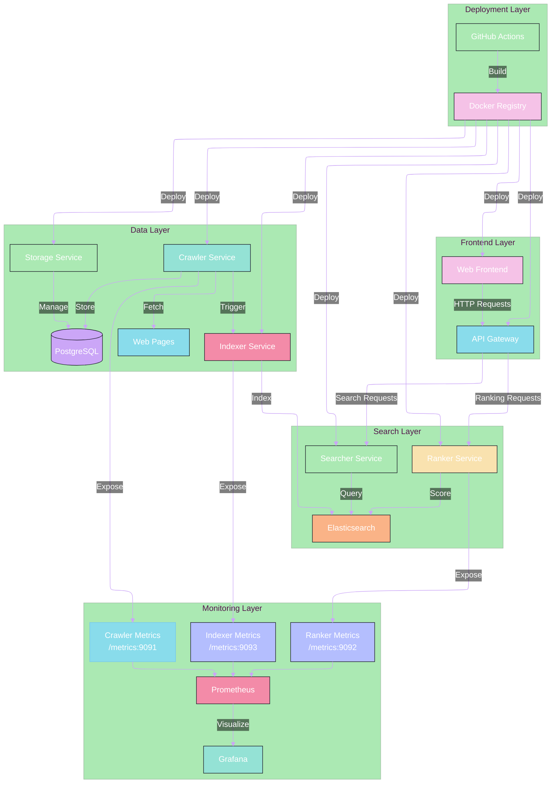

# Architecture Overview

Sonoma Search is built using a microservices architecture, designed for scalability, maintainability, and reliability. The system is composed of several independent services that work together to provide a comprehensive search solution.

## System Architecture

## Layer Description

### Frontend Layer
- **Web Frontend**: User interface for search interactions
- **API Gateway**: Central entry point for all client requests

### Search Layer
- **Searcher Service**: Handles search queries and retrieval
- **Ranker Service**: Implements search result ranking algorithms
- **Elasticsearch**: Search engine for efficient text search and indexing

### Data Layer
- **Crawler Service**: Fetches and processes web pages
- **Indexer Service**: Processes and indexes documents
- **Storage Service**: Manages data persistence
- **PostgreSQL**: Primary data store

### Deployment Layer
- **GitHub Actions**: CI/CD pipeline
- **Docker Registry**: Container image storage and distribution

### Monitoring Layer
- **Prometheus**: Metrics collection and storage
- **Grafana**: Metrics visualization and alerting
- **Service Metrics**: Each service exposes metrics on dedicated ports

## Communication Flow

1. Users interact with the Web Frontend
2. Requests are routed through the API Gateway
3. Search requests are processed by the Searcher and Ranker services
4. The Crawler continuously fetches new web pages
5. The Indexer processes and indexes new documents
6. The Storage Service manages data persistence
7. All services are monitored through Prometheus and Grafana

## Service Dependencies

- **Frontend → API Gateway**: HTTP/REST
- **API Gateway → Services**: HTTP/REST
- **Services → Elasticsearch**: HTTP/REST
- **Services → PostgreSQL**: Native PostgreSQL protocol
- **Services → Prometheus**: Metrics exposition 
