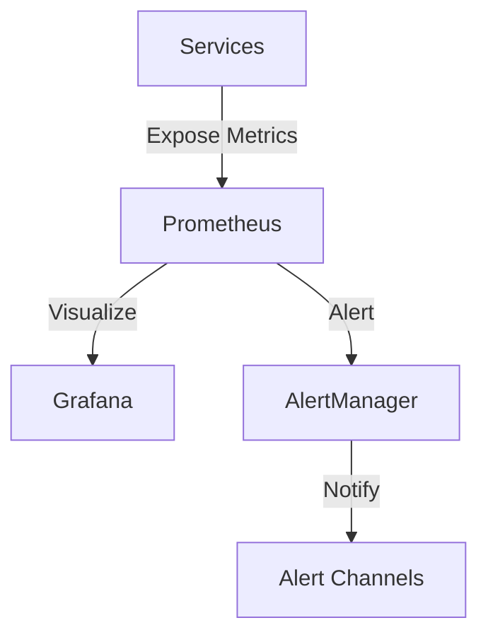

# Monitoring Overview

This document provides an overview of the monitoring setup for the Sonoma Search engine.

## Architecture



## Components

### Metrics Endpoints

Each service exposes metrics on dedicated ports:

| Service    | Metrics Port | Endpoint        |
|------------|-------------|-----------------|
| API Gateway| 9090        | `/metrics`      |
| Searcher   | 9091        | `/metrics`      |
| Ranker     | 9092        | `/metrics`      |
| Indexer    | 9093        | `/metrics`      |
| Crawler    | 9094        | `/metrics`      |
| Storage    | 9095        | `/metrics`      |

### Core Metrics

1. **Application Metrics**
   - Request counts
   - Response times
   - Error rates
   - Cache hit rates

2. **Resource Metrics**
   - CPU usage
   - Memory usage
   - Disk I/O
   - Network traffic

3. **Business Metrics**
   - Search queries/sec
   - Crawl rate
   - Index size
   - Query latency

## Monitoring Stack

### Prometheus
- Metrics collection
- Data storage
- Query language
- Alert rules

### Grafana
- Metrics visualization
- Dashboard creation
- Alert management
- User management


## Dashboard Categories

### Service Dashboards

1. **API Gateway**
   - Request volume
   - Response times
   - Error rates
   - Cache performance

2. **Search Services**
   - Query performance
   - Result quality
   - Cache efficiency
   - Error tracking

3. **Data Services**
   - Crawl status
   - Index health
   - Storage metrics
   - Queue status

### Infrastructure Dashboards

1. **System Resources**
   - CPU utilization
   - Memory usage
   - Disk space
   - Network I/O

2. **Container Metrics**
   - Container health
   - Resource usage
   - Restart count
   - Network stats

3. **Database Metrics**
   - Connection pools
   - Query performance
   - Index stats
   - Replication lag

### Business Dashboards

1. **Search Analytics**
   - Popular queries
   - Result clicks
   - User satisfaction
   - Search trends

2. **Content Metrics**
   - Crawl coverage
   - Index freshness
   - Content quality
   - Update frequency

## Alert Rules

### Critical Alerts

1. **Service Health**
   ```yaml
   - alert: ServiceDown
     expr: up == 0
     for: 1m
     labels:
       severity: critical
     annotations:
       summary: "Service {{ $labels.instance }} down"
   ```

2. **High Error Rate**
   ```yaml
   - alert: HighErrorRate
     expr: rate(http_requests_total{status=~"5.."}[5m]) > 0.1
     for: 2m
     labels:
       severity: critical
     annotations:
       summary: "High error rate on {{ $labels.instance }}"
   ```

### Warning Alerts

1. **High Latency**
   ```yaml
   - alert: HighLatency
     expr: http_request_duration_seconds > 1
     for: 5m
     labels:
       severity: warning
     annotations:
       summary: "High latency on {{ $labels.instance }}"
   ```

2. **Resource Usage**
   ```yaml
   - alert: HighCPUUsage
     expr: container_cpu_usage_seconds_total > 0.8
     for: 10m
     labels:
       severity: warning
     annotations:
       summary: "High CPU usage on {{ $labels.instance }}"
   ```

## Retention Policies

1. **Metrics Data**
   - Raw metrics: 15 days
   - 5-minute aggregates: 6 months
   - 1-hour aggregates: 2 years

2. **Alert History**
   - Active alerts: Indefinite
   - Resolved alerts: 90 days
   - Alert snapshots: 30 days

## Access Control

1. **User Roles**
   - Admin: Full access
   - Operator: Write access
   - Viewer: Read-only access
   - Custom roles

2. **Dashboard Permissions**
   - Public dashboards
   - Team dashboards
   - Private dashboards
   - Shared dashboards

## Best Practices

1. **Metric Naming**
   - Use consistent prefixes
   - Include service name
   - Add relevant labels
   - Follow naming conventions

2. **Dashboard Design**
   - Clear titles
   - Consistent layout
   - Useful descriptions
   - Appropriate time ranges

3. **Alert Configuration**
   - Avoid alert fatigue
   - Set appropriate thresholds
   - Include runbooks
   - Define escalation paths

4. **Performance**
   - Optimize queries
   - Set appropriate scrape intervals
   - Use recording rules
   - Monitor cardinality 